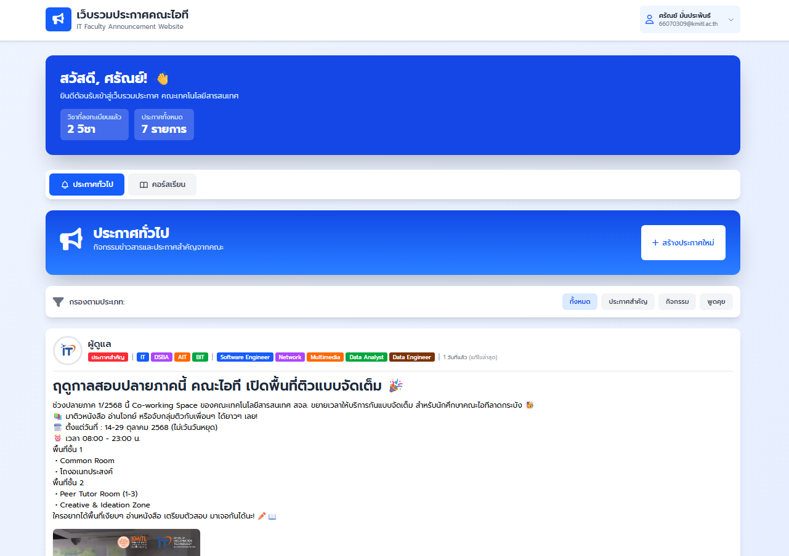
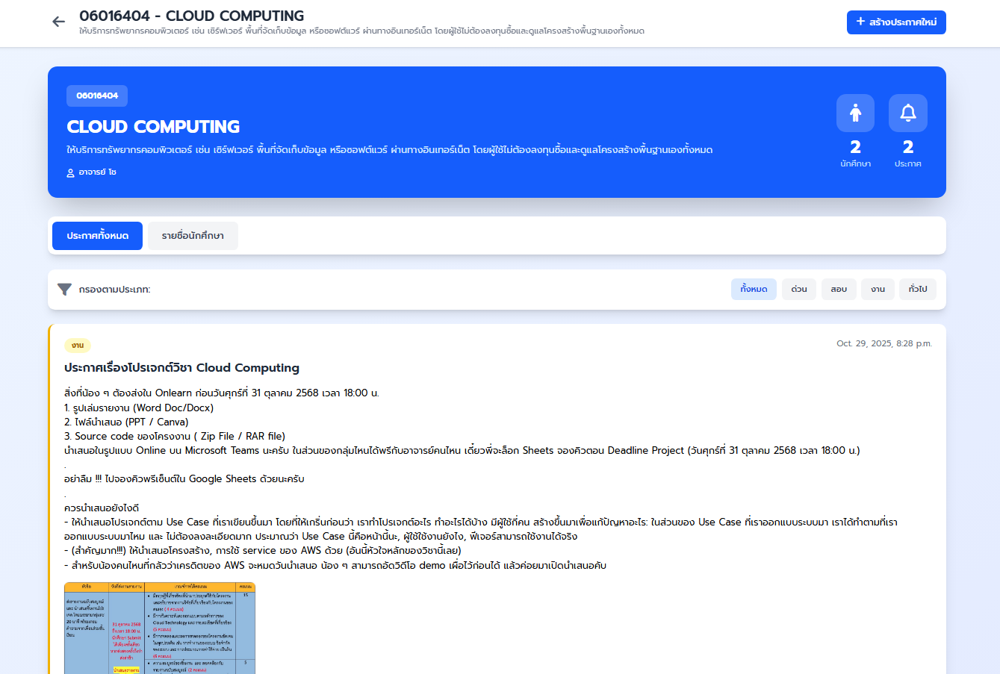

# 📢 IT-POST
**A Robust Centralized Web Application for Faculty Announcements and Event Management.**

[](https://www.djangoproject.com/)
[](https://aws.amazon.com/)
[](https://www.postgresql.org/)
[](https://tailwindcss.com/)

## 🌟 Overview
**IT-POST** เป็นเว็บแอปพลิเคชันที่ออกแบบมาเพื่อเป็นศูนย์กลางในการกระจายข่าวสาร ประกาศ และกิจกรรมต่างๆ ภายในคณะ โดยเน้นความเสถียรของระบบและการจัดการข้อมูลที่มีประสิทธิภาพผ่าน RESTful APIs และโครงสร้างพื้นฐานบน Cloud ที่รองรับการกู้คืนระบบอัตโนมัติ 

---

## 📸 User Interface
<p align="center">
  
  
</p>
<p align="center">
  <em>ตัวอย่างหน้าจอหลักของระบบและการแสดงผลรายละเอียดประกาศตามรายวิชา</em>
</p>

---

## ✨ Key Features
* **Centralized Information Hub:** ออกแบบและพัฒนา Backend Services เพื่อรวบรวมข่าวสารและกิจกรรมของคณะไว้ในที่เดียว.
* **RESTful API Integration:** พัฒนา API ด้วย Django เพื่อจัดการข้อมูลประกาศและผู้ใช้งานร่วมกับ PostgreSQL.
* **Cloud Architecture:** ติดตั้งระบบบน AWS โดยใช้ EC2 สำหรับประมวลผล, RDS สำหรับฐานข้อมูล และ S3 สำหรับจัดเก็บไฟล์ Static ต่างๆ.
* **Security & IAM:** กำหนดสิทธิ์การเข้าถึงทรัพยากรบน Cloud ด้วย IAM Roles และจัดการ Environment Variables เพื่อความปลอดภัยของข้อมูล.

## 🛠 Advanced Technical Highlight: Automated Fault Tolerance
หนึ่งในฟีเจอร์สำคัญของโปรเจกต์นี้คือการทำ **Automated EC2 Recovery Workflow** เพื่อเพิ่ม Availability ให้กับระบบ:
* ใช้ **EventBridge** ในการตรวจจับสถานะของ Instance.
* Trigger **AWS Lambda** เพื่อรัน Script ในการเปลี่ยน Instance ใหม่จาก **AMI** โดยอัตโนมัติเมื่อเกิดความล้มเหลว.
* ทำการ **Reassign Elastic IP** โดยอัตโนมัติเพื่อให้ผู้ใช้งานยังคงเข้าถึงเว็บไซต์ได้ผ่าน URL เดิมโดยไม่มี Downtime นานเกินไป.

---

## 💻 Tech Stack
| Category | Technology Used |
| --- | --- |
| **Backend** | Django (Python)  |
| **Frontend** | HTML, Tailwind CSS, JavaScript  |
| **Database** | PostgreSQL  |
| **Cloud Infrastructure** | AWS (EC2, RDS, S3, Lambda, EventBridge, IAM)  |

---

## 🚀 Getting Started
1.  **Clone the repository:**
    ```bash
    git clone https://github.com/pckzy/SSW-ITPost.git
    ```
2.  **Install Dependencies:**
    ```bash
    pip install -r requirements.txt
    ```
3.  **Database Migration:**
    ```bash
    python manage.py migrate
    ```
4.  **Run Server:**
    ```bash
    python manage.py runserver
    ```
